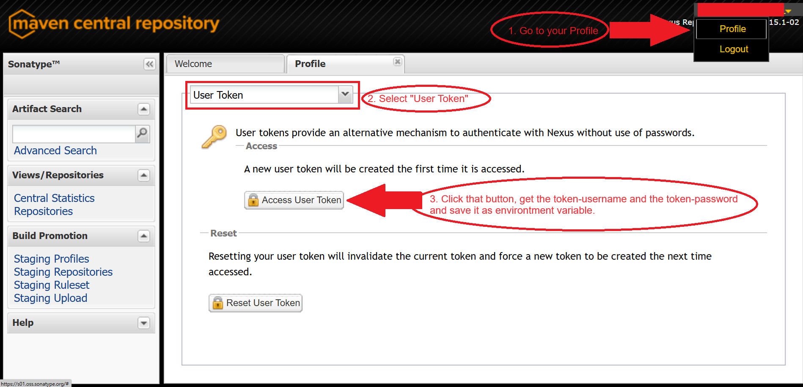

### Description

This document should guide you through the process of publishing a gradle project to the maven central repository.

### Versions used

| Software | Version |
|----------|---------|
| Gradle   | 7.4.2   |
| GnuPG    | 2.4.0   |

### Guide

##### Step 1: Upload your code to a VCS

Upload your code to a VCS like github.

##### Step 2: Claim your namespace in the maven central repository

Your project will have a custom package path aka group id - e. g. <code>com.yourwebsite.yourapp</code>. 
This must be claimed in the maven central repository.

<b><i>2.1: Create an account in sonatypes JIRA</i></b> 

Please follow this link: https://issues.sonatype.org/

During this process, a member of Sonatype will create an account on the nexus for you. The url to the nexus is
e.g. https://s01.oss.sonatype.org/.

<b><i>2.2: Create an issue for your project hosting</i></b> 

| Topic                     | Value                                                        |
|---------------------------|--------------------------------------------------------------|
| Projekt                   | Community Support - Open Source Project Repository Hosting   |
| Type                      | New Project                                                  |
| Summary                   | Global/Central open source project packages hosting          |
| Description               | There is need for a library which simplifies abc development |
| Group Id                  | The group id                                                 |
| Project URL               | e.g. https://github.com/yourname/yourapp                     |
| SCM URL                   | e.g. https://github.com/yourname/yourapp.git                 |
| Username(s)               | Usernames (your username on github)                          |
| Already synced to central | No                                                           |

<b><i>2.3: Wait until a human or a bot answers</i></b> 

<b><i>2.4: Prove that this namespace is really yours</i></b> 

A bot will guide you through this process. In short:

If your namespace is a website, then you must create a DNS TXT record with your JIRA ticket id. 
You can lookup this process in the internet - this is not too hard.

As alternative you can set your namespace to something like this: "io.github.yourgithubusername". 
Then you only need to create a temporary public repository with the ticket id as name. 

You will be informed per email if everything is ok or if there is a problem.

##### Step 3: Create a PGP key pair

You need this for signing your code. This is mandatory because if you do not do this, no one can verify, if this code is
really your code.

<b><i>3.1: Install GnuPG</i></b> 

    https://www.gnupg.org/download/

<b><i>3.2: Create your public key</i></b> 

Go through the wizard and type in your information:

    gpg --full-generate-key

    Keytype:   RSA and RSA
    Keylength: 2048 Bit
    Validity:  Does not expire (be aware of this!)

<b><i>3.3: Display all your created public keys</i></b> 

This will display your created public key:

    gpg --list-keys

    pub   rsa2048 2023-03-27 [SC]
          XXXXXXXXXXXXXXXXXXXXXXXXXXXXXXXX12345678 <-(The last 8 characters are your key id)
    uid      [ ultimativ ] Firstname Lastname email@email.com
    sub   rsa2048 2023-03-27 [E]

<b><i>3.4: Create a private key out of your public key</i></b> 

In this step you will be forced to enter a password. 
DO NOT FORGET THIS PASSWORD. YOUR KEY WILL BE LOST FOREVER. BACKUP THIS PASSWORD.

Create your private key:

    gpg --export-secret-keys 12345678 > "C:\Users\<username>\.gnupg\secring.gpg"

Check if your private key is created:

    gpg --list-secret-keys

##### Step 4: Create a backup of your PGP key pair

Do not ignore this step. 
You can not recover your keys if they are messed up. 
Your key will live in the internet forever. 
If this step does not work, try as long as you need until this step works. 
Do not go any further without creating a backup. 
I recommend during both style of the backup - just for security.

#### Step 4.1: Hardcopy style

###### Step 4.1.1: Create the backup

    cp ~/.gnupg/pubring.gpg /path/to/backups/
    cp ~/.gnupg/secring.gpg /path/to/backups/
    cp ~/.gnupg/trustdb.gpg /path/to/backups/

###### Step 4.1.2: Import the backup

    cp /path/to/backups/*.gpg ~/.gnupg/

#### Step 4.2: Export/Import style

###### Step 4.2.1: Create the backup

Backup the public keys:

    gpg --export --export-options backup --output publicKeysBackup.gpg

Backup the private keys:

    gpg --export-secret-keys --export-options backup --output privateKeysBackup.gpg

Backup the trust relationship database:

    gpg --export-ownertrust > trustBackup.gpg

###### Step 4.2.2: Import the backup

Import the public keys:

    gpg --import publicKeysBackup.gpg

Import the private keys:

    gpg --import privateKeysBackup.gpg

Import the trust relationship database:

    gpg --import-ownertrust trustBackup.gpg

    If this does not work, try this:
    gpg --edit-key email@email.com
    Enter: trust
    Enter: 5
    Enter: j/y

Check for correct import:

    gpg --list-secret-keys --keyid-format LONG

### Step 5: Publish your public key on a public key server

https://central.sonatype.org/publish/requirements/gpg/#distributing-your-public-key  
Publish your key: 

    gpg --keyserver keyserver.ubuntu.com --send-keys XXXXXXXXXXXXXXXXXXXXXXXXXXXXXXXX12345678

Check if your key is published:

    gpg --keyserver hkp://keyserver.ubuntu.com --search-key 'email@email.com'

### Step 6: Prepare your global gradle.properties for publishing

The global gradle.properties are located in "userHome/.gradle/gradle.properties". 
If this file does not exist, then create it.

The project intern gradle wrapper will look into this file too. 
Here you can save your password from your key etc. This should not be published. ;)

Please look in the directory "exampleFiles".

    Please read the comments in this file.

### Step 7: Prepare your build.gradle for publishing

#### Step 7.1: Generate a token

You must generate a token because the old way (using the standard username and password) does not work anymore.

1. Navigate to https://s01.oss.sonatype.org/.
2. Click on your "golden" user name and navigate to "Profile".
3. Select "User Token" in the dropdown.
4. Click on "Access User Token", get the token-username and the token-password and save them in an environment variable.
5. Restart your IDE after doing that - DON'T ASK, DO IT.

#### Step 7.2: Example file

Please look in the directory "exampleFiles".

    Please read the comments in this file.

### Step 8: Publish to OSSRH nexus with gradle publish

Execute the gradlew task "publish" to publish to the OSSRH nexus. 
Now you need to wait around 5-30 minutes and after that, your uploaded library will appear in the repositories tab
at https://s01.oss.sonatype.org/.

### Step 9: Release your library

After publishing to the nexus, your library is in the state "open". 
You need to set the state to "close" with the "close" button. 
Press the "refresh" button, because this seems to be buggy. 
Now the "release" button is activated. 
Press the "release" button for releasing your library. 
Your library will by synced to the maven central repository within 30 minutes.

Please read this articles (annoying, but necessary):  
https://central.sonatype.org/publish/release/#locate-and-examine-your-staging-repository  
https://central.sonatype.org/publish/publish-guide/#releasing-to-central

### Step 10: Profit

### Error handling

If any error occurs, than rerun the task <code>gradle publish</code> with <code>--stacktrace</code>. It will show you
hints why.

#### Caused by gpg2.exe is not found

Check your gpg version with <code>gpg --version</code>. If your version is >2 and your environment variable <code>
PATH</code> contains the path to GnuPG (e.g. <code>C:\Program Files (x86)\gnupg\bin</code>), then check if there is a
file called <code>gpg2.exe</code>. If not, check if there is a file called <code>gpg.exe</code> and rename it to <code>
gpg2.exe</code>.

IMPORTANT: From now on, you need to use <code>gpg2</code> with parameter like <code>--version</code> in your
terminal/command prompt because there is no longer a <code>gpg.exe</code>!!!

#### 401 Content access is protected by token

This error message occurs if you try to publish to OSSRH via your username and password. This does not work anymore.
You must create and use a user token.

1. Navigate to https://s01.oss.sonatype.org/.
2. Click on your "golden" user name and navigate to "Profile".
3. Select "User Token" in the dropdown.
4. Click on "Access User Token", get the token-username and the token-password and save them in an environment variable.
5. Restart your IDE after doing that - DON'T ASK, DO IT.

Original documentation: https://central.sonatype.org/publish/generate-token/

#### The dependency is not available on maven central repository

Don't get fooled by the indexed search on https://mvnrepository.com/. This process can take around 2 days (personal
experience). If you want to test it, create a separate project, include the dependency in it, and try to load it. Or
wait until you get grey hair.

### What to do if my key was hacked

You need to revoke the key from the keyserver by publishing a revocation certificate to it. This informs others that the
key shouldn't be trusted anymore.

##### Get the ID of your key first:

For a public key use <code>gpg --list-keys</code>, for a private key use <code>gpg --list-secret-keys</code>.
In both ways the ID of the keys are the last 8 characters.

    gpg --list-keys

    pub   rsa2048 2023-03-27 [SC]
          XXXXXXXXXXXXXXXXXXXXXXXXXXXXXXXX12345678 <-(The last 8 characters are your key id)
    uid      [ ultimativ ] Firstname Lastname email@email.com
    sub   rsa2048 2023-03-27 [E]

##### Next steps:

1. Generate a revocation certificate: <code>gpg --output revoke.asc --gen-revoke 12345678</code> You must enter
   the password of your key during this process.
2. Revoke the key: <code>gpg --import revoke.asc</code> <code>gpg --send-keys 12345678</code>
3. Export the public key: <code>gpg --armor --export 12345678 > public-key.asc</code>
4. Send the key to the keyserver: <code>gpg --send-keys 12345678</code>
5. Done!

